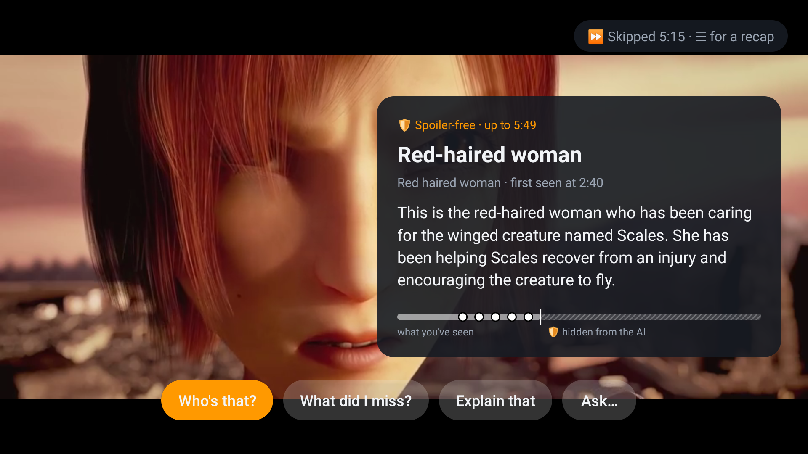
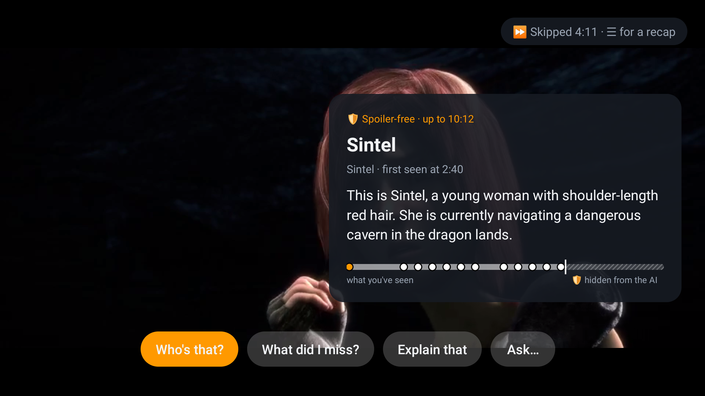

# What Did I Miss? — a spoiler-free viewing companion for Fire TV

Ask your TV *"who's that?"*, *"what did I miss?"* or *"why was that a foul?"* mid-show and get a
short answer in an overlay that **only uses what you have already watched**.

**Track:** Fire TV · **Mini challenges:** AWS Builder (Amazon Bedrock), Open Source

## The idea: a spoiler fence in code, not in the prompt

Most "AI companions" hand the model a full plot and ask it not to spoil. We never give it the future:

1. **Ingest (offline, per title)** — `pipeline/ingest.py` watches the video in order, 20-second window
   at a time, with frames + subtitles, and writes a time-indexed `timeline.json` (scenes, characters,
   facts, name reveals). Each window only sees the past, so even the descriptions can't foreshadow.
2. **Fence (per question)** — `backend/app/fence.py` cuts the timeline at the viewer's position *T*:
   finished scenes only, facts learned before *T*, and characters under the name the viewer knows
   *so far* ("hooded stranger" stays a stranger until unmasked).
3. **Answer** — the model (Claude on Bedrock by default) gets the fenced view + the current video
   frame + the question and returns a 3-sentence overlay answer.

The fence starts at ingest: on *Sintel*, the model that clearly knows the film still logs its
lead as "Red-haired Traveler" until the story names her.

```
Fire TV app (Kotlin, Media3)            AWS
  player position T ─┐              ┌─────────────────────────────┐
  current frame ─────┼─ POST /ask ─▶│ Lambda: fence(timeline, T)  │──▶ Claude (Bedrock)
  question / mode ───┘              │ S3: titles/<id>/timeline.json│
                                    └─────────────────────────────┘
```

## Measured, not claimed

`eval/leak_test.py` asks the same questions at the same playback positions of two arms — ours,
and a normal assistant holding the whole plot and politely asked not to spoil — then has a third
model judge every answer against the part of the film the viewer has *not* reached.

| arm | leaks | questions | leak rate |
|---|---|---|---|
| **fenced (ours)** | **0** | 30 | **0%** |
| baseline | 9 | 30 | 30% |

*Sintel*, 5 positions × 6 questions (two neutral, four fishing for the ending), judge and both
arms on `gemini-3.1-flash-lite`, 2026-09-20. Full report: `eval/leak_report.md`.

Getting there took three fixes that the measurement itself surfaced: the model read the lead's
name off the title, so the backend now redacts names the viewer has not heard (`_redact_future_names`);
it filled gaps from its own memory of a famous film, so the prompt tells it to ignore what it
recognises and stay traceable to the log; and the judge counted the scene playing on screen as
"unseen", which was a flaw in the test, not the product.

The same question, the same film, two positions — the fence is the only difference:

| *Who's that?* at 5:49 | the same button at 10:12 |
|---|---|
|  |  |


> **at 5:00** — "The red-haired woman is a traveler who cares for a small, injured, winged creature
> named Scales. **Her background beyond that has not been revealed yet.**"
>
> **at 9:00** — "**The red-haired woman is named Sintel.** She has been travelling and searching for
> a dragon, and she is currently in the dragon lands."

An earlier run leaked once: the model read the lead's name off the title (*Sintel*) before the film
says it. The fix is in code, not in the prompt — the backend knows which names are still unrevealed
and swaps them back for what the viewer currently calls that character (`_redact_future_names`).

## Repo layout

| Path | What |
|---|---|
| `android-tv/` | Fire TV app: catalog, ExoPlayer, companion overlay (☰ Menu button), frame capture, resume recap |
| `backend/app/fence.py` | Spoiler fence (pure Python, unit-tested) |
| `backend/app/companion.py` | Prompting + structured answer |
| `backend/app/handler.py` | Lambda routes: `GET /titles`, `POST /ask` |
| `backend/local_server.py` | Same routes on your LAN for development |
| `backend/template.yaml` | AWS SAM stack (HTTP API + Lambda + S3) |
| `pipeline/ingest.py` | Video + SRT → `data/titles/<id>/timeline.json` |

## Quick start

```bash
# 1. Backend deps + tests
pip install -r backend/requirements.txt imageio-ffmpeg
cd backend && python -m unittest discover -s tests -t .

# 2a. Light local copy for smooth playback (the backend serves media/ at /media/, with Range)
ffmpeg -i https://download.blender.org/durian/movies/Sintel.2010.1080p.mkv -vf scale=960:-2 \
  -c:v libx264 -preset veryfast -crf 24 -g 48 -c:a aac -b:a 96k -movflags +faststart media/sintel_540p.mp4
#     then pass --video-url /media/sintel_540p.mp4 below (relative = served by the backend;
#     in Git Bash prefix the command with MSYS_NO_PATHCONV=1)

# 2b. Build a timeline (Sintel, CC-BY Blender Foundation). Try --limit-s 120 first: each window is one model call.
python pipeline/ingest.py --title-id sintel --title "Sintel" \
  --video media/Sintel.2010.1080p.mkv --subs media/sintel_en.srt \
  --video-url https://download.blender.org/durian/movies/Sintel.2010.1080p.mkv

# 3. Run the backend on your LAN (AWS credentials with Bedrock access in the environment)
python backend/local_server.py 8080
#    or without Bedrock: LLM_PROVIDER=anthropic ANTHROPIC_API_KEY=... python backend/local_server.py

# 4. Install on Fire TV (Settings → My Fire TV → Developer options → ADB debugging)
adb connect <fire-tv-ip>:5555
cd android-tv && ./gradlew installDebug -PcompanionUrl=http://<your-pc-ip>:8080
```

On the TV: open a title, press **☰ (Menu)** on the remote → *Who's that?* / *What did I miss?* /
*Explain that* / *Ask…*. **Back** closes the overlay and resumes playback.

- **Skip-aware recap** — fast-forward more than 30 s and the app offers *"⏩ Skipped 2:30 · ☰ for a
  recap"*; the recap covers exactly the part you jumped over.
- **Resume recap** — reopening a title you left mid-way shows *Previously…*.
- **Character card** — *Who's that?* also shows when you first met them, under the name you know them by.
- **Sport mode** — a title ingested with `--kind sport --rules data/rules/american-football.txt`
  answers rule questions for a newcomer, and the score is fenced like everything else: at 2:00 of
  the demo game it says 13-0, not the 34-20 it ends on.
- **Knowledge bar** — every answer shows the title's timeline: what you've watched, the moments the
  answer draws on, the recapped range, and everything after your position hatched out as
  *hidden from the AI*. Markers are clamped to your position server-side, so even a model citing
  a future timestamp can't put it on screen. The same markers appear on the player's seek bar.

No Bedrock access yet? `LLM_PROVIDER=mock python backend/local_server.py` answers with canned text
built from the real fenced context, and `ingest.py --subs-only` builds a subtitles-only timeline.

## Deploy to AWS

```bash
cd backend && sam build && sam deploy --guided
python ../pipeline/publish.py --bucket <DataBucketName>   # timelines + catalog.json
```

## Configuration

Set these in the environment, or in a gitignored `.env.local` at the repo root
(`LLM_PROVIDER=anthropic`, `ANTHROPIC_API_KEY=...`), which every entry point loads.

| Env var | Default | |
|---|---|---|
| `LLM_PROVIDER` | `bedrock` | `anthropic`, `gemini` (AI Studio free tier), or `mock` |
| `LLM_MODEL` | per provider | `anthropic.claude-opus-5` / `claude-opus-5` / `gemini-3.1-flash-lite` |
| `AWS_REGION` | `us-east-1` | Bedrock region |
| `ANTHROPIC_API_KEY` / `GEMINI_API_KEY` | – | for those providers |
| `DATA_BUCKET` | – | S3 bucket; unset = read `data/titles/` |

## Content & licenses

Demo content: *Sintel* © Blender Foundation, CC-BY 3.0 (durian.blender.org); *Oregon vs.
Washington St* college football highlights © FOX Sports, CC BY 3.0, via Wikimedia Commons. In production this is
an SDK a streaming app embeds in its own player; the app needs its own playback position, which is
why the demo plays content itself rather than reading other apps' screens.
